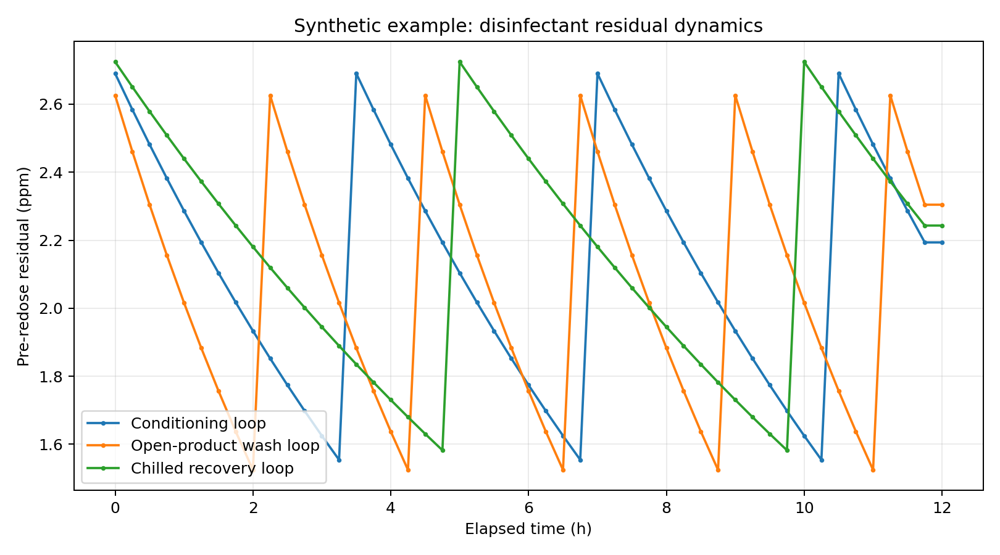
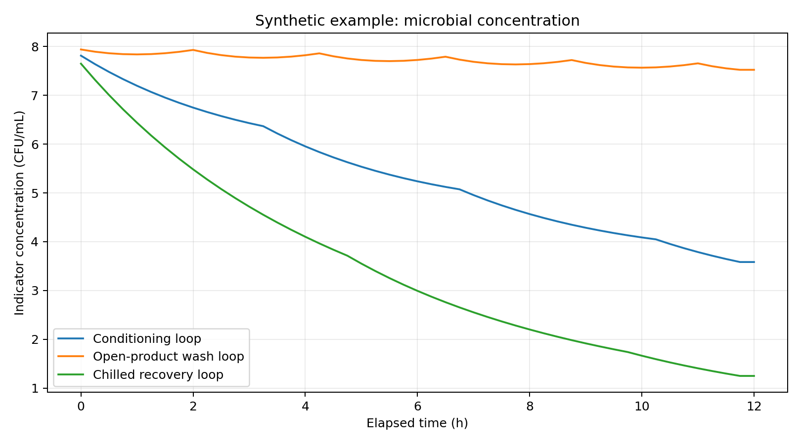

# Dynamic Process-Water Microbial & Disinfectant Model

A Python simulation framework for exploring how **microbial kinetics, process-water turnover, contamination loading and disinfectant residual dynamics** interact in recirculating food-process water systems.

This repository is a **generalised and anonymised portfolio version** of a model originally developed during an industrial food-processing project. All example process conditions, organisms, coefficients and control values in this repository are **synthetic demonstration data** and must not be interpreted as validated food-safety limits.

## Why I built it

Process-water safety is a dynamic problem: microbial concentration can change with temperature, time, contamination input, water replacement and disinfectant performance. A static limit alone does not show how quickly control may deteriorate.

This model combines those effects into a transparent time-step simulation that can be used for:

- process-validation planning
- scenario and sensitivity analysis
- water-reuse / turnover assessment
- disinfectant-control studies
- identification of critical process parameters
- communication between process engineering and food-safety teams

## Engineering concepts demonstrated

- dynamic process modelling
- microbial growth kinetics
- Ratkowsky-type temperature dependence
- logistic population dynamics
- continuous stirred-tank (CSTR) dilution
- disinfectant CT-style inactivation
- first-order disinfectant decay
- automated redosing logic
- parameterised CSV inputs
- scenario analysis
- validation-status traceability
- automated result generation and plotting
- unit testing

## Model architecture

```text
Process conditions
      |
      v
Microbial kinetics ----> pH / aw modifiers
      |
      v
Disinfectant inactivation
      |
      v
Contamination loading
      |
      v
CSTR-style dilution / water turnover
      |
      v
Disinfectant residual decay
      |
      v
Redose / control checks / outputs
```

Each cycle records both **pre-redose** and **post-redose** disinfectant residual, so temporary loss of residual is not hidden by the dosing logic.

## Core equations

### Temperature-dependent microbial growth

For sub-optimal temperatures:

\[
\mu = [b(T-T_{min})]^2
\]

The resulting rate is modified by pH, water activity and scenario factors before logistic population growth is applied.

### Logistic microbial growth

\[
N_{t+\Delta t}
=
\frac{K N_t e^{\mu \Delta t}}
{K+N_t(e^{\mu \Delta t}-1)}
\]

### Simplified disinfectant inactivation

\[
LR = k_{CT}\,C\,\Delta t\,f_{pH}\,f_T\,f_{organic}
\]

and

\[
N_{after}=N_{before}\,10^{-LR}
\]

### Well-mixed water replacement

For balanced make-up and discharge flow:

\[
f = 1-e^{-(Q/V)\Delta t}
\]

\[
N_{mixed}=(1-f)N+fN_{replacement}
\]

### Disinfectant residual decay

\[
C_{t+\Delta t}
=
C_t e^{-k\Delta t}
-
D\Delta t
\]

where `k` is a first-order decay coefficient and `D` represents an empirical demand-loss term.

See [`docs/equations.md`](docs/equations.md) for the implementation details and limitations.

## Repository structure

```text
process-water-dynamics-model/
├── README.md
├── LICENSE
├── requirements.txt
├── pyproject.toml
├── src/process_water_model/
│   ├── __init__.py
│   ├── model.py
│   └── cli.py
├── config/
│   ├── water_systems.csv
│   ├── organisms.csv
│   ├── contamination_inputs.csv
│   ├── disinfection_controls.csv
│   ├── ct_parameters.csv
│   └── scenarios.csv
├── examples/
│   └── run_example.py
├── outputs/
├── docs/
│   ├── equations.md
│   ├── validation_strategy.md
│   └── assets/
└── tests/
    └── test_model.py
```

## Quick start

```bash
git clone https://github.com/YOUR-USERNAME/process-water-dynamics-model.git
cd process-water-dynamics-model

python -m venv .venv
source .venv/bin/activate      # macOS/Linux
# .venv\Scripts\activate       # Windows

pip install -r requirements.txt
python examples/run_example.py
```

Or install the package in editable mode:

```bash
pip install -e .
process-water-model --input-dir config --output-dir outputs
```

The example run creates:

- `results_by_cycle.csv`
- `summary.csv`
- `run_metadata.json`
- disinfectant-residual plots
- microbial-concentration plots

## Example outputs

### Disinfectant residual dynamics



### Example microbial dynamics



The included figures are generated from **synthetic inputs** solely to demonstrate model behaviour.

## Validation philosophy

This is deliberately a **validation-support model**, not a mechanism for generating food-safety limits from literature values alone.

Before use for an industrial decision, the model should be calibrated and challenged using site data such as:

1. actual vessel and retained-water volumes
2. measured make-up, discharge and recirculation flows
3. process temperature and pH profiles
4. disinfectant residual decay under clean and production-loaded conditions
5. contamination-loading measurements
6. microbiological time-series data
7. sensor accuracy and dosing-response delays
8. shutdown, standstill, restart and flushing behaviour

The calibrated model should then be independently reviewed and compared with commissioning / challenge-test results.

See [`docs/validation_strategy.md`](docs/validation_strategy.md).

## What this project demonstrates

The main objective of this repository is to demonstrate how I approach a process-engineering problem:

**translate a food-safety question into mass-balance, kinetic and control equations; build a reproducible simulation; expose assumptions; and define the measurements required to validate the model.**

## Limitations

The current model assumes:

- one completely mixed water volume per system
- constant process conditions during each simulation
- balanced make-up and discharge flow
- simplified CT-style disinfection
- no explicit biofilm compartment
- no spatial temperature or disinfectant gradients
- deterministic rather than probabilistic microbiology
- immediate redosing when the trigger is reached
- synthetic coefficients in the public example dataset

It should therefore not be used as a substitute for plant validation, regulatory requirements, microbiological challenge testing or HACCP approval.

## Author

Food Technology / Biotechnology student interested in **bioprocess engineering, process modelling, food biotechnology and data-driven process optimisation**.

## License

MIT License. See [`LICENSE`](LICENSE).
